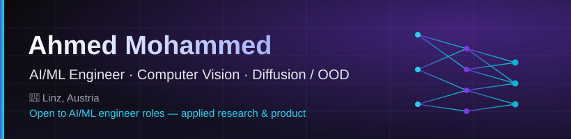
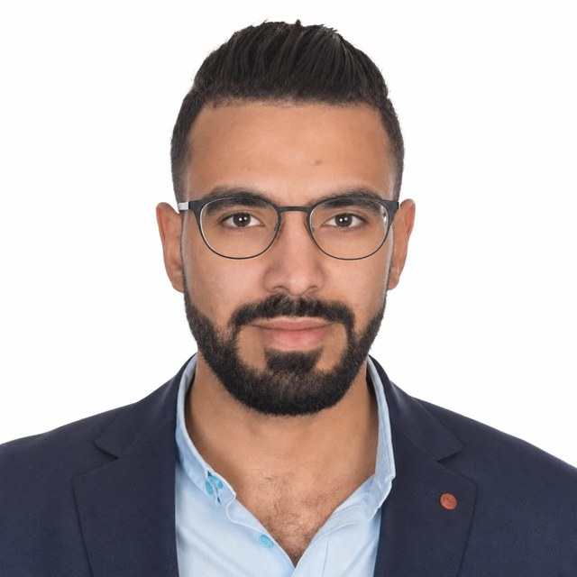
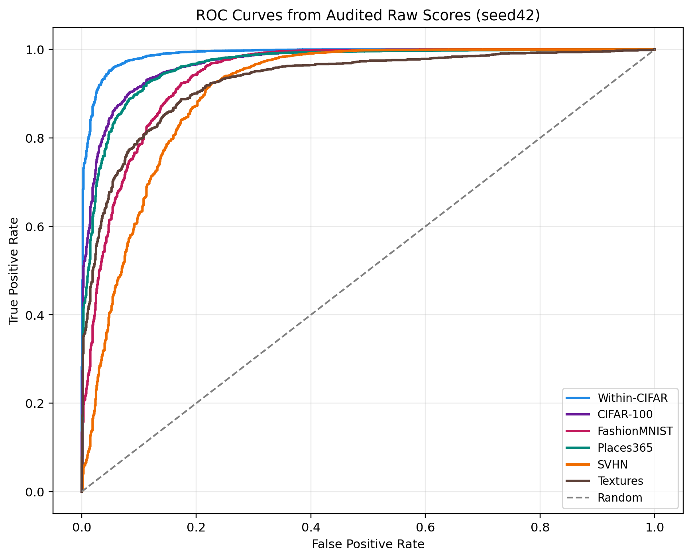

  

<table>
  <tr>
    <td width="180" valign="middle" align="center">
      
    </td>
    <td valign="middle">
      <b>AI/ML Engineer &amp; Founder</b> · Linz, Austria 
      Turning research into shipped products — from an <b>M.Sc. thesis on conditional diffusion for OOD detection</b> to <b><a href="https://sihem-pwa.pages.dev/">Sihem</a></b>, a live LLM personal-mentor assistant.
        
      
      
      
      
      
    </td>
  </tr>
</table>

---

### 👋 About Me

I'm an **AI/ML engineer and founder** specializing in **computer vision**, **anomaly detection**, and **diffusion models** — bridging cutting-edge research with production systems. A few things I'm proud of:

- 🔬 **Research → SOTA:** my [M.Sc. thesis at JKU Linz](https://github.com/ahmed-3m/DiffusionOOD) introduced a **conditional-diffusion + separation-loss** method for out-of-distribution detection, reaching **99.03% AUROC** on CIFAR-10.
- 🏭 **Research → industry:** at [PROFACTOR GmbH](https://www.profactor.at) I transferred the same method to real-world **industrial defect detection** with **98.4% accuracy**.
- 🚀 **Research → product:** I built **[Sihem](https://sihem-pwa.pages.dev/)** — an LLM-driven personal-mentor assistant (Telegram bot + installable PWA) with proactive cron-driven check-ins and long-term memory.
- 🤗 **In the open:** I publish my work (DiffusionOOD, InkjetOOD, plus self-training LLM experiments) on **[HuggingFace](https://huggingface.co/ahmed-3m)** — 32 public models.

### 🚀 Featured Work

<table>
  <tr>
    <td width="50%" valign="top">
      <h3 align="center">🏹 <a href="https://sihem-pwa.pages.dev/"><b>Sihem</b></a></h3>
      
<b>LLM-driven personal-mentor assistant</b>

      
Weekly planning, morning briefings, evening reviews, smart check-ins, and long-term memory. Try it on <a href="https://t.me/Sihem_AI_bot">Telegram @Sihem_AI_bot</a> or the <a href="https://sihem-pwa.pages.dev/">installable PWA</a>.

      
<b>Invitation code:</b> <code>gh26</code>

      
<code>LLM</code> · <code>Supabase</code> · <code>Deno</code> · <code>PWA</code>

    </td>
    <td width="50%" valign="top">
      <h3 align="center">🔬 <a href="https://github.com/ahmed-3m/DiffusionOOD"><b>DiffusionOOD</b></a></h3>
      
<b>Conditional diffusion + separation loss for OOD detection</b>

      
Core of my M.Sc. thesis @ JKU Linz — reached <b>99.03% AUROC</b> on CIFAR-10 OOD detection.

      
<code>PyTorch</code> · <code>DDPM</code>

    </td>
  </tr>
  <tr>
    <td width="50%" valign="top">
      <h3 align="center">🏭 <a href="https://github.com/ahmed-3m/InkjetOOD"><b>InkjetOOD</b></a></h3>
      
<b>Industrial transfer of the thesis method</b>

      
YOLOv8 + multi-head diffusion UNet for label-efficient defect scoring on industrial inkjet QC (FTI_Zer0P).

      
<code>PyTorch</code> · <code>Diffusion</code> · <code>YOLO</code>

    </td>
    <td width="50%" valign="top">
      <h3 align="center">🤗 <a href="https://huggingface.co/ahmed-3m"><b>Self-Training LLMs</b></a></h3>
      
<b>Self-improving LLM experiments</b>

      
DPO-ST, SDPO &amp; LaSeR self-training runs on GV100 Volta GPUs — published as open models.

      
<code>LLMs</code> · <code>DPO</code> · <code>Self-training</code>

    </td>
  </tr>
  <tr>
    <td width="50%" valign="top">
      <h3 align="center">🧠 <a href="https://github.com/ahmed-3m/Motor-Imagery-classification"><b>EEG / Brain-Computer Interface</b></a></h3>
      
<b>Deep RNN for motor-imagery classification</b>

      
Brain-signal decoding on the PhysioNet dataset for BCI applications.

      
<code>TensorFlow</code> · <code>LSTM</code>

    </td>
    <td width="50%" valign="top">
      <h3 align="center">🌐 <a href="https://github.com/ahmed-3m/ahmed-3m.github.io"><b>Portfolio Website</b></a></h3>
      
<b>Designed, built &amp; deployed by me</b>

      
Next.js 16 / React 19 portfolio with a GitHub-activity strip and an auto-updating AI-news feed (CI agent).

      
<code>Next.js</code> · <code>React</code> · <code>TS</code>

    </td>
  </tr>
</table>

### 🔍 Research Highlight

   
  CIFAR-10 out-of-distribution detection ROC from <a href="https://github.com/ahmed-3m/DiffusionOOD">DiffusionOOD</a> — the conditional-diffusion + separation-loss classifier reaches <b>99.03% AUROC</b>.

### 🧰 Tech Stack

  
  
  
  
  
  
  
   
  
  
  
  

### 📊 GitHub Stats

  
  

### 🌱 Currently Building &amp; Learning

- 🏹 Scaling **[Sihem](https://sihem-pwa.pages.dev/)** — an LLM personal-mentor assistant (PWA channel + proactive triggers)
- 🔬 Self-training &amp; alignment methods for LLMs (DPO-ST, SDPO, LaSeR) — [models on HuggingFace](https://huggingface.co/ahmed-3m)
- 📡 Image restoration applied to INTEGRAL satellite imagery

### 💼 Open to Work

**Looking for AI/ML engineer roles** — applied research and full-stack product. Strong fit for teams shipping computer-vision, generative, or anomaly-detection systems from prototype to production.

